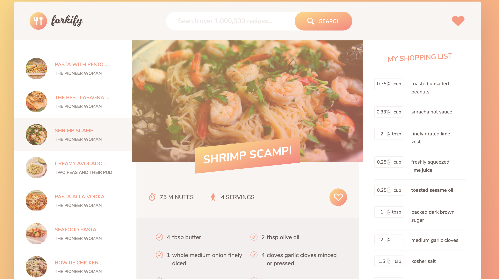

# My.Forkify
A recipe lookup and save app that allows the user to search for recipes, save favorites, adjust the portions and servings, and keep a shopping list. The app calls on the forkify-API and was cloned for instructional purposes from a Udemy course on Javascript.



## Key Features
- Keyword search
- Savable recipes
- Shopping lists
- Adjustable portions
- Adjustable ingredients
- Preferences in local storage

## Tech
- axios
- babel
- fractional
- uniqid
- webpack

## Setup and Usage
Clone this repo to your desktop and run npm install to install all the dependencies:

```bash
# Clone this repository
$ git clone https://github.com/N0matic/my.forkify

# Go into the repository
$ cd my.forkify

# Install dependencies
$ npm install

# Run the app
$ npm start
```

### Sources
Udemy.com: The Complete JavaScript Course 2020: Build Real Projects!
Created by [Jonas Schmedtmann](https://github.com/jonasschmedtmann)